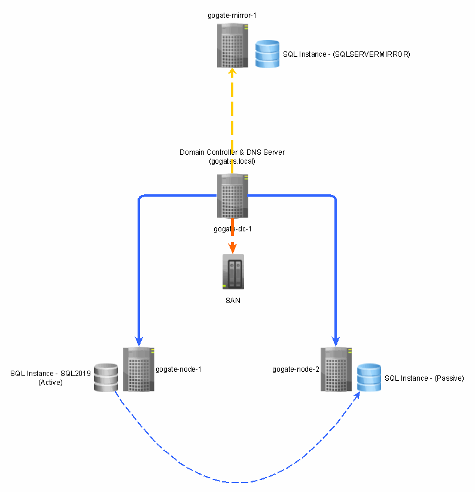

# SQLServer2019-Mirroring
How to enable mirroring in SQL Server

# Intruduction
We are assuming that we already have SQL 2019 Cluster (Active / Passive) environment setup - between Node1 & Node2. However, what if both nodes goes down? or something goes wrong with SAN device?
In such cases, considering Disaster Recovery (DR), it's ideal to have another environment setup (Preferably in Cloud).

## 1. Installation of Windows Server 2019 Server as Mirror Server (On-Premise)
We are going to have 4th Virtual Machine - first 3 are - [gogate-dc-1]:Domain Controller/SAN, [gogate-node-1]:Primary Node, [gogate-node-2]:Secondary Node & [gogate-mirror-1]:Mirroring node - as Mirror and we will add that in same Network with other 3 VMs. 
  Node, for Mirror server, we are not going to have shared drives. Sole purpose of this separate server is for DR - in case if first 3 VMs goes down or something happens with SAN itself. Since Mirror server will store all SQL files locally, it will not have any depedancy on SAN or other 2 VMs.
1. Install Windows Server 2019 by creating a Virtual Machine
2. Change machine name 
3. Allocate IP Address 
   #### Computer Name 
        1. This PC --> Properties --> Advanced System Settings --> Computer Name (gogate-mirror-1)
   #### IP Addresses
        1. Control Panel --> Network & Internet --> Network and Sharing Center --> Ethernet0 --> Properties --> Internet Protocol Verstion 4 --> (TCP/IPv4)
           - Static IP Address : 192.168.80.50 (https://www.paessler.com/it-explained/ip-address) & (https://www.rapidtables.com/convert/number/binary-to-decimal.html)
           - Subnet Mask : 255.255.255.0 (https://www.paessler.com/it-explained/ip-address)
           - Default Gateway : 192.168.80.2 [Same for all VMs] (https://en.wikipedia.org/wiki/Default_gateway)
           - Preferred DNS Server : 192.168.80.10 [Same for all VMs] (https://www.cloudflare.com/learning/dns/what-is-a-dns-server/)
           - Alternet DNS Server : Keep blank
   #### Disable Firewall
        1. Control Panel --> System and Security --> Windows Defender Firewall --> Turn Off Windows Defender Firewall
        
## 2. Adding (gogate-mirror-1) to Domain
1. Validate if you can ping to Domain from both the nodes - ping gogates.local
2. Assign domain name for both nodes 
   - This PC --> Properties --> Advanced System Settings --> Member Of Domain - gogates.local
   - Specify credentials for Domain Admin - gogates\Administrator & P@ssword#123
   - Restart server
   - Follow same steps for both nodes
   - While logging you should be able to login as Domain Administrator user instead of local Administrator
   - Validate nodes in Domain Controller using "Active Directory Users and Computers" 

## 3. Install stand alone SQL Server Instance
   1. Before you install SQL Server instance, make sure you have internet connectivity from new mirror VM. Since you have changed the IP of already existing NIC card, its not sharing a network with your main PC & eventually even internet. Add another NIC card which will share the same IP range as your main PC.
   2. Install SQL server instance - GOGATE-MIRROR-1\SQLSERVERMIRROR
## 4. Implementation
   1. Need - https://docs.microsoft.com/en-us/sql/database-engine/database-mirroring/database-mirroring-sql-server?view=sql-server-ver15
   2. Pre-requisits - https://docs.microsoft.com/en-us/sql/database-engine/database-mirroring/setting-up-database-mirroring-sql-server?view=sql-server-ver15
   3. Steps - https://docs.microsoft.com/en-us/sql/database-engine/database-mirroring/establish-database-mirroring-session-windows-authentication?view=sql-server-ver15
   4. database-mirroring-error-1418 - https://dba.stackexchange.com/questions/23878/mirroring-server-network-address-cannot-be-reached
   5. Microsoft SQL Server, Error: 1416 - https://howardsimpson.blogspot.com/2020/07/database-is-not-configured-for-database-mirroring-microsoft-sql-server-error-1416.html
   6. Restoring database from "Restoring State" - https://www.mssqltips.com/sqlservertip/5460/sql-server-database-stuck-in-restoring-state/
      <b>RESTORE DATABASE [earnings] WITH RECOVERY</b>
   
